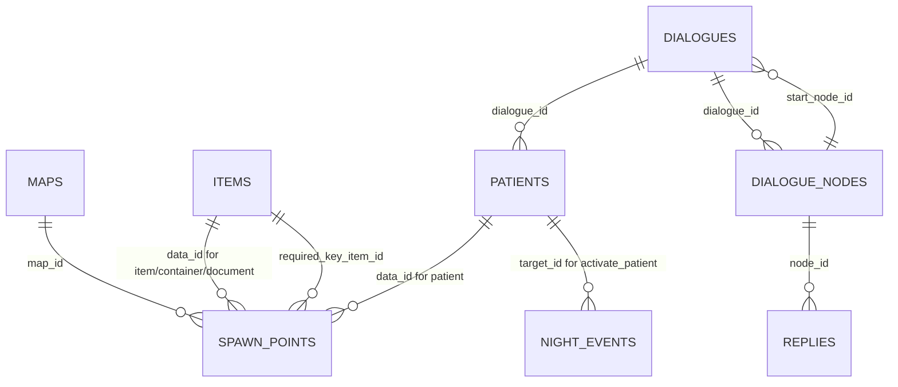

# Руководство по работе с JSON-данными PSYCHEMPATHY

Документ предназначен для геймдизайнера, который редактирует контент игры без изменения C++-кода. Все основные игровые данные находятся в каталоге `assets/`.

## Общие правила

1. Все JSON-файлы должны оставаться валидными.
2. Идентификаторы `id` должны быть уникальными внутри своего файла или логической таблицы.
3. Связи между файлами выполняются через числовые идентификаторы.
4. Строковые ключи должны записываться в `snake_case`.
5. После изменения JSON-файлов игру нужно запускать заново, потому что данные загружаются при старте.
6. Если игра не запускается, в первую очередь нужно проверить запятые, кавычки и корректность ссылок по `id`.

## Список файлов

| Файл | Назначение |
|---|---|
| `game_config.json` | Общие правила игры: время смены, скорость времени, стартовые характеристики, рассудок. |
| `items.json` | Предметы, лекарства, ключи и документы. |
| `patients.json` | Пациенты, их сложность и привязка к диалогам. |
| `dialogues.json` | Диалоги, узлы диалогов и варианты ответов. |
| `maps.json` | ASCII-карты комнат. |
| `spawn_points.json` | Размещение игрока, предметов, пациентов, дверей и объектов на картах. |
| `night_events.json` | События, которые происходят по времени смены. |

## Реляционная схема данных



## `game_config.json`

Файл задаёт глобальные параметры игры.

```json
{
  "starting_map_id": 1,
  "shift_duration_seconds": 900,
  "time_scale": 2.0,
  "stat_allocation": {
    "start_authority": 1,
    "start_medication": 1,
    "free_points": 8,
    "max_stat": 10
  },
  "sanity": {
    "initial": 100,
    "max": 100,
    "passive_drain_per_minute": 3,
    "passive_drain_interval_seconds": 12
  }
}
```

Поля:

- `starting_map_id`: карта, на которой начинается игра.
- `shift_duration_seconds`: длительность смены в игровых секундах.
- `time_scale`: множитель скорости времени. Значение `2.0` означает, что игровое время идёт в два раза быстрее реального.
- `start_authority`: стартовое значение авторитета.
- `start_medication`: стартовое значение медикации.
- `free_points`: свободные очки на экране распределения характеристик.
- `max_stat`: максимальное значение характеристики.
- `sanity.initial`: стартовый рассудок.
- `sanity.max`: максимальный рассудок.
- `passive_drain_per_minute`: сколько рассудка теряется за один тик.
- `passive_drain_interval_seconds`: как часто происходит потеря рассудка.

## `items.json`

Файл содержит список предметов.

Пример:

```json
{
  "id": 1,
  "name": "Слабое успокоительное",
  "type": "medicine",
  "description": "Небольшая доза возвращает дыхание в ровный ритм.",
  "sanity_restore": 12,
  "dialogue_bonus": 2,
  "consumable": true
}
```

Поля:

- `id`: уникальный идентификатор предмета.
- `name`: название предмета.
- `type`: тип предмета. Используемые типы: `medicine`, `document`, `key`.
- `description`: описание предмета.
- `sanity_restore`: сколько рассудка восстанавливает предмет.
- `dialogue_bonus`: бонус к следующей реплике в диалоге.
- `consumable`: исчезает ли предмет после использования.

Рекомендации:

- Для ключей ставьте `type = "key"`, `consumable = false`.
- Для документов ставьте `type = "document"`, `consumable = false`.
- Для медикаментов обычно используются `sanity_restore > 0` и `consumable = true`.

## `patients.json`

Файл содержит список пациентов.

Пример:

```json
{
  "id": 101,
  "name": "Анна Орлова",
  "archetype": "тревожное состояние",
  "max_tension": 24,
  "resistance": 4,
  "dialogue_id": 201,
  "dialogue_cooldown_seconds": 120
}
```

Поля:

- `id`: уникальный идентификатор пациента.
- `name`: имя пациента.
- `archetype`: краткое описание состояния.
- `max_tension`: начальное и максимальное напряжение пациента.
- `resistance`: сопротивление пациента. Вычитается из эффективности реплики.
- `dialogue_id`: ссылка на диалог из `dialogues.json`.
- `dialogue_cooldown_seconds`: время до повторной доступности диалога после стабилизации.

Баланс:

- Чем выше `max_tension`, тем дольше стабилизировать пациента.
- Чем выше `resistance`, тем слабее работают реплики.
- Если пациент слишком сложный, уменьшите `resistance` или `max_tension`.

## `dialogues.json`

Файл состоит из трёх логических таблиц:

- `dialogues`: общие данные диалогов;
- `nodes`: узлы диалога;
- `replies`: варианты ответов врача.

### Таблица `dialogues`

```json
{
  "id": 201,
  "start_node_id": 2011,
  "success_text": "Анна садится на кровать и наконец делает спокойный вдох.",
  "fail_text": "Паника Анны заражает весь коридор."
}
```

Поля:

- `id`: уникальный идентификатор диалога.
- `start_node_id`: первый узел диалога.
- `success_text`: сообщение при успешной стабилизации.
- `fail_text`: резервный текст для неудачи.

### Таблица `nodes`

```json
{
  "id": 2011,
  "dialogue_id": 201,
  "patient_text": "Они идут по потолку. Вы тоже слышите?",
  "state_hint": "Пациентка мечется взглядом и сжимает край халата."
}
```

Поля:

- `id`: уникальный идентификатор узла.
- `dialogue_id`: ссылка на диалог.
- `patient_text`: реплика пациента.
- `state_hint`: описание состояния пациента на экране диалога.

### Таблица `replies`

```json
{
  "id": 1,
  "node_id": 2011,
  "text": "Я рядом. Давайте назовём три вещи, которые вы видите на стене.",
  "base_impact": 7,
  "min_authority": 1,
  "min_medication": 1,
  "authority_scale": 1,
  "medication_scale": 1,
  "fail_sanity_damage": 2,
  "next_node_id": 2012
}
```

Поля:

- `id`: уникальный идентификатор реплики.
- `node_id`: узел, в котором показывается реплика.
- `text`: текст ответа врача.
- `base_impact`: базовая эффективность реплики.
- `min_authority`: минимальный авторитет для выбора реплики.
- `min_medication`: минимальная медикация для выбора реплики.
- `authority_scale`: множитель влияния авторитета.
- `medication_scale`: множитель влияния медикации.
- `fail_sanity_damage`: урон рассудку при плохом результате.
- `next_node_id`: следующий узел диалога.

Формула эффективности:

```text
impact = base_impact
       + authority * authority_scale
       + medication * medication_scale
       + pending_item_bonus
       - patient_resistance
```

Если `impact < 0`, игра считает его равным `0`.

Доступность реплик:

- Реплика доступна, если `authority >= min_authority` и `medication >= min_medication`.
- Если требования не выполнены, реплика отображается с пометкой, но выбрать её нельзя.
- Бонус предмета `dialogue_bonus` не открывает закрытые реплики, а только усиливает выбранную доступную реплику.

## `maps.json`

Файл содержит список комнат.

Пример:

```json
{
  "id": 1,
  "name": "Пост медсестры",
  "width": 40,
  "height": 15,
  "layout": [
    "########################################",
    "#......................................#",
    "########################################"
  ]
}
```

Поля:

- `id`: уникальный идентификатор карты.
- `name`: название комнаты.
- `width`: ширина карты.
- `height`: высота карты.
- `layout`: массив строк карты.

Символы карты:

- `#`: стена.
- `.`: пол.

Важно:

- Все строки `layout` должны иметь одинаковую длину.
- Длина строки должна совпадать с `width`.
- Количество строк должно совпадать с `height`.
- Игровые объекты не размещаются в `layout`; они создаются через `spawn_points.json`.

## `spawn_points.json`

Файл размещает сущности на картах.

Общие поля:

- `id`: уникальный идентификатор точки появления.
- `map_id`: карта, на которой создаётся объект.
- `entity_type`: тип создаваемой сущности.
- `data_id`: ссылка на предмет или пациента, если нужна.
- `x`, `y`: координаты на карте.
- `prompt_text`: подсказка взаимодействия.

Типы `entity_type`:

- `player`: стартовая позиция игрока.
- `item`: предмет, который можно подобрать.
- `document`: документ, который можно прочитать.
- `patient`: пациент.
- `door`: дверь или переход.
- `container`: контейнер с предметом.

### Предмет

```json
{
  "id": 10,
  "map_id": 2,
  "entity_type": "item",
  "data_id": 1,
  "x": 8,
  "y": 12,
  "prompt_text": "подобрать предмет"
}
```

`data_id` должен ссылаться на `items.id`.

### Пациент

```json
{
  "id": 8,
  "map_id": 2,
  "entity_type": "patient",
  "data_id": 101,
  "x": 18,
  "y": 4,
  "prompt_text": "поговорить с Анной"
}
```

`data_id` должен ссылаться на `patients.id`.

### Дверь

```json
{
  "id": 4,
  "map_id": 1,
  "entity_type": "door",
  "data_id": 0,
  "x": 38,
  "y": 7,
  "target_map_id": 2,
  "target_x": 2,
  "target_y": 7,
  "locked": false,
  "required_key_item_id": 0,
  "prompt_text": "перейти в палатный коридор"
}
```

Поля двери:

- `target_map_id`: карта назначения.
- `target_x`, `target_y`: координаты игрока после перехода.
- `locked`: заперта ли дверь.
- `required_key_item_id`: предмет-ключ, необходимый для открытия. Если ключ не нужен, используется `0`.

### Контейнер

```json
{
  "id": 12,
  "map_id": 3,
  "entity_type": "container",
  "data_id": 2,
  "x": 8,
  "y": 4,
  "prompt_text": "обыскать шкафчик",
  "empty_prompt_text": "пустой шкафчик"
}
```

`data_id` указывает предмет, который будет выдан при первом обыске.

## `night_events.json`

Файл содержит события, завязанные на время смены.

Пример:

```json
{
  "id": 1,
  "phase": "Middle",
  "trigger_time": 300,
  "event_type": "activate_patient",
  "target_id": 102,
  "message": "Из дальней палаты слышится удар в дверь."
}
```

Поля:

- `id`: уникальный идентификатор события.
- `phase`: текстовая фаза ночи.
- `trigger_time`: время срабатывания в игровых секундах.
- `event_type`: тип события.
- `target_id`: цель события.
- `message`: сообщение, которое появится в HUD.

Типы событий:

- `activate_patient`: активирует пациента. `target_id` должен ссылаться на `patients.id`.
- `show_message`: выводит сообщение. `target_id` можно оставить `0`.
- `increase_sanity_drain`: увеличивает пассивную потерю рассудка. `target_id` используется как числовой модификатор.

## Как добавить новый предмет

1. Добавить запись в `items.json` с новым уникальным `id`.
2. Добавить точку появления в `spawn_points.json`:
   - `entity_type = "item"`;
   - `data_id = id предмета`;
   - указать `map_id`, `x`, `y`.
3. Убедиться, что координаты находятся на полу, а не в стене.

## Как добавить нового пациента

1. Добавить диалог в `dialogues.json`.
2. Добавить пациента в `patients.json`.
3. В поле `dialogue_id` указать `id` созданного диалога.
4. Добавить точку появления пациента в `spawn_points.json`:
   - `entity_type = "patient"`;
   - `data_id = id пациента`.

## Как добавить новую комнату

1. Добавить карту в `maps.json` с новым уникальным `id`.
2. Добавить дверь в `spawn_points.json`, которая ведёт в новую комнату.
3. Добавить обратную дверь из новой комнаты.
4. Добавить нужные предметы, пациентов или контейнеры через `spawn_points.json`.

## Как добавить новый диалог

1. Создать запись в `dialogues`.
2. Создать стартовый узел в `nodes`.
3. Указать `start_node_id` в записи диалога.
4. Добавить реплики в `replies` с `node_id`, равным id стартового узла.
5. При необходимости добавить второй узел и связать его через `next_node_id`.
6. Привязать диалог к пациенту через `patients.dialogue_id`.

## Частые ошибки

- Пропущена запятая между JSON-объектами.
- Используются одинарные кавычки вместо двойных.
- Повторяется уже существующий `id`.
- `data_id` ссылается на несуществующий предмет или пациента.
- `dialogue_id` у пациента ссылается на несуществующий диалог.
- `start_node_id` ссылается на несуществующий узел.
- `target_map_id` двери ссылается на несуществующую карту.
- Координаты объекта находятся внутри стены.
- В `layout` строки разной длины.
- Используется старое имя поля в camelCase вместо актуального `snake_case`.

## Рекомендуемый порядок проверки изменений

1. Проверить JSON в любом валидаторе.
2. Проверить уникальность `id`.
3. Проверить связи между файлами.
4. Запустить игру.
5. Проверить, что объект появился на нужной карте.
6. Проверить взаимодействие с объектом.
7. Проверить баланс: сложность пациента, скорость потери рассудка, силу предметов и реплик.
