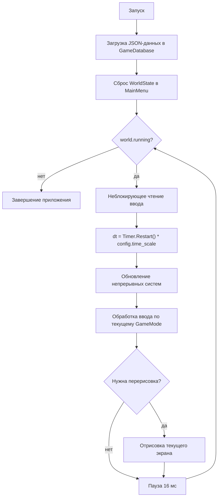
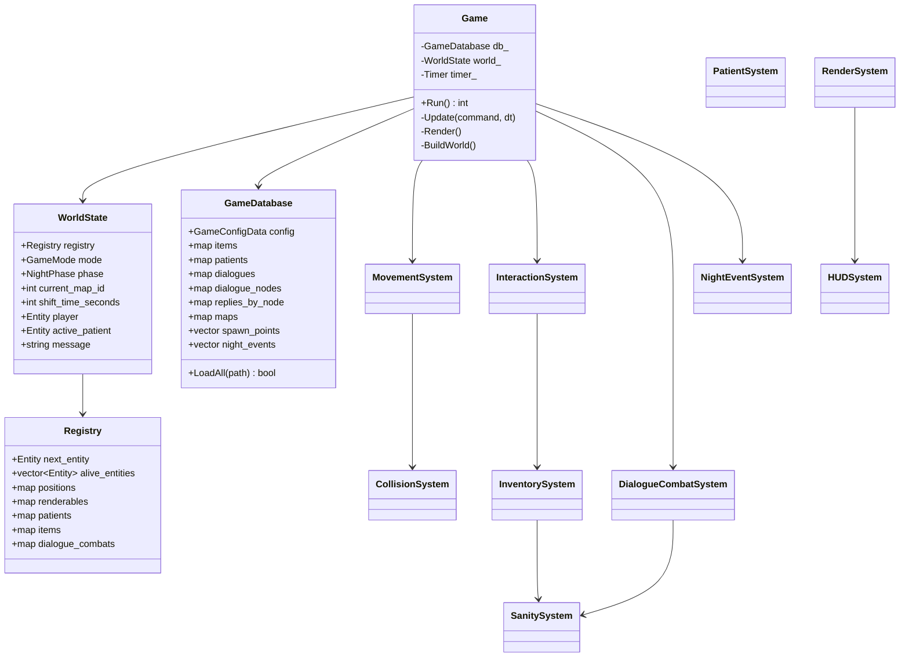
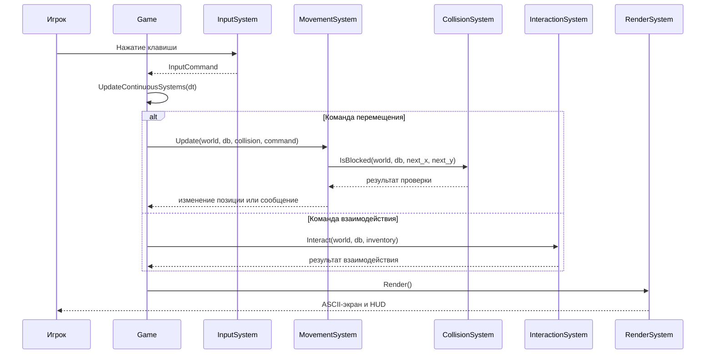
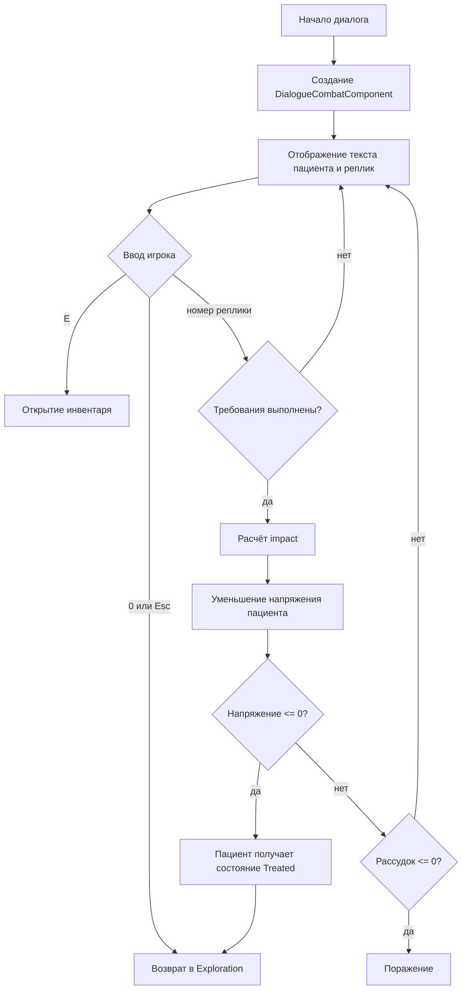

# PSYCHEMPATHY

`PSYCHEMPATHY` представляет собой прототип консольной игры в жанре 2D top-down survival horror с элементами RPG. Игрок управляет врачом во время ночной смены в психиатрической больнице. Основные игровые действия включают исследование помещений, поиск предметов, управление уровнем рассудка и взаимодействие с пациентами через систему диалогового боя.

## Управление

- Главное меню: `W/S` или стрелки для выбора пункта, `Enter` для подтверждения.
- Распределение характеристик: `W/S` для выбора параметра, `A/D` для изменения значения, `Enter` для начала игры.
- Исследование: `WASD` или стрелки для перемещения, `F` для взаимодействия, `E` для открытия инвентаря, `Esc` для выхода.
- Инвентарь: стрелки для выбора предмета, `Enter`, `U` или цифровая клавиша для использования, `E` или `Esc` для возврата.
- Диалоговый бой: цифровые клавиши для выбора реплики, `E` для открытия инвентаря, `0` или `Esc` для выхода из диалога.

## Реализованные механики

- Главное меню.
- Экран распределения характеристик.
- ECS-подобная архитектура `Entity + Components + Systems`.
- Загрузка геймдизайнерских данных из JSON-файлов.
- Отображение ASCII-карт больницы.
- Несколько комнат с переходами через двери.
- Перемещение игрока по карте.
- Коллизии со стенами, дверями и блокирующими сущностями.
- Интерактивные объекты: предметы, двери, контейнеры, документы, пациенты.
- Инвентарь с предметами и расходуемыми медикаментами.
- Шкала рассудка и пассивное снижение рассудка с течением времени.
- Диалоговый бой с пациентами.
- Проверка доступности реплик по характеристикам врача.
- Влияние характеристик `authority` и `medication` на эффективность реплик.
- Использование предметов для восстановления рассудка и усиления диалога.
- Ночные события: активация пациента, текстовое уведомление, усиление потери рассудка.
- Повторная доступность пациентов для разговора после периода восстановления.
- Условия победы и поражения.

## Геймдизайнерские данные

Геймдизайнерские данные вынесены в каталог `assets/`. Для работы с JSON используется библиотека `nlohmann/json`, подключаемая через CMake `FetchContent`.

- `game_config.json`: глобальные параметры игры, включая длительность смены, масштаб времени, правила распределения характеристик и параметры рассудка.
- `items.json`: описание предметов, медикаментов, ключей и документов.
- `patients.json`: описание пациентов, их архетипов, сопротивления, максимального напряжения, времени восстановления и связанных диалогов.
- `dialogues.json`: описание диалогов, узлов диалога и реплик врача.
- `maps.json`: ASCII-карты помещений.
- `spawn_points.json`: точки появления игрока, предметов, пациентов, дверей, контейнеров и документов.
- `night_events.json`: события ночной смены, срабатывающие по времени.

### Реляционная модель данных

JSON-файлы организованы как набор взаимосвязанных таблиц. Связи между ними реализованы через числовые идентификаторы.

- `spawn_points.map_id` ссылается на `maps.id`.
- `spawn_points.data_id` ссылается на `items.id` для предметов, документов и контейнеров.
- `spawn_points.data_id` ссылается на `patients.id` для пациентов.
- `spawn_points.required_key_item_id` ссылается на `items.id` для запертых дверей.
- `spawn_points.target_map_id` ссылается на `maps.id` для переходов между комнатами.
- `patients.dialogue_id` ссылается на `dialogues.id`.
- `dialogues.start_node_id` ссылается на идентификатор узла диалога.
- `dialogue_nodes.dialogue_id` ссылается на `dialogues.id`.
- `replies.node_id` ссылается на узел, в котором отображается реплика.
- `replies.next_node_id` ссылается на следующий узел диалога.
- `night_events.target_id` ссылается на пациента для события `activate_patient`; для события `increase_sanity_drain` поле используется как числовой модификатор.

## Описание классов и структур

### Основные структуры времени выполнения

- `Game`: центральный класс приложения. Управляет основным игровым циклом, текущим состоянием мира, базой данных, системами и переходами между режимами игры.
- `WorldState`: структура текущего состояния игры. Содержит ECS-реестр, текущий режим, текущую комнату, время смены, идентификатор игрока, активного пациента и последнее сообщение.
- `Registry`: ECS-хранилище. Создаёт и удаляет сущности, а также хранит таблицы компонентов.
- `Timer`: вспомогательный класс для вычисления времени между кадрами.
- `GameDatabase`: структура загруженных JSON-данных. Содержит таблицы предметов, пациентов, диалогов, карт, точек появления, событий и глобальной конфигурации.

### Основные компоненты

- `PositionComponent`: координаты сущности на карте.
- `MapComponent`: идентификатор комнаты, к которой относится сущность.
- `RenderableComponent`: символ, цвет и слой отображения.
- `CollisionComponent`: признак блокировки перемещения.
- `PlayerTag`: маркер игрока.
- `StatsComponent`: характеристики врача.
- `SanityComponent`: текущее и максимальное значение рассудка, параметры пассивного снижения.
- `InventoryComponent`: набор слотов инвентаря.
- `ItemComponent`: ссылка на предмет из базы данных.
- `PatientComponent`: состояние пациента, уровень напряжения и ссылка на диалог.
- `DoorComponent`: параметры двери и перехода между комнатами.
- `InteractableComponent`: тип взаимодействия и текст подсказки.
- `DialogueCombatComponent`: состояние активного диалогового боя.

### Основные системы

- `InputSystem`: считывает клавиатурный ввод в Windows-консоли.
- `MovementSystem`: обрабатывает перемещение игрока.
- `CollisionSystem`: проверяет выход за границы, стены и блокирующие сущности.
- `InteractionSystem`: выполняет взаимодействие с объектами рядом с игроком.
- `InventorySystem`: управляет добавлением, удалением и использованием предметов.
- `SanitySystem`: изменяет значение рассудка и применяет пассивное снижение.
- `DialogueCombatSystem`: реализует диалоговый бой.
- `NightEventSystem`: управляет временем смены, фазами ночи и событиями.
- `PatientSystem`: возвращает пациентов к повторному диалогу после периода восстановления.
- `RenderSystem`: формирует текстовые экраны игры.
- `HUDSystem`: формирует информацию интерфейса: рассудок, время, фазу, сообщение и подсказку.

## WorldState

`WorldState` является центральной структурой состояния игры. Она передаётся в системы и изменяется ими в процессе выполнения.

Состав `WorldState`:

- `registry`: реестр ECS-сущностей и компонентов.
- `mode`: текущий режим игры.
- `inventory_return_mode`: режим, в который игра должна вернуться после закрытия инвентаря.
- `phase`: текущая фаза ночи.
- `current_map_id`: идентификатор текущей комнаты.
- `shift_time_seconds`: прошедшее время смены.
- `shift_duration_seconds`: длительность смены.
- `player`: идентификатор сущности игрока.
- `active_patient`: идентификатор пациента, участвующего в текущем диалоге.
- `running`: флаг работы основного цикла.
- `message`: последнее игровое сообщение.

## Алгоритм основного игрового цикла

Основной цикл выполняется в классе `Game`. Он не блокируется ожиданием ввода, поэтому время смены и снижение рассудка происходят независимо от действий игрока.

Алгоритм:

1. Инициализировать параметры Windows-консоли.
2. Загрузить JSON-данные в `GameDatabase`.
3. Сбросить состояние игры в главное меню.
4. Пока `world.running == true`:
   - считать ввод без блокировки;
   - вычислить прошедшее время кадра;
   - умножить время на `game_config.time_scale`;
   - обновить непрерывные системы: ночные события, таймеры пациентов, рассудок;
   - обработать ввод в зависимости от текущего `GameMode`;
   - выполнить перерисовку при необходимости.
5. Завершить выполнение приложения.



## Реализация игровых механик

### Перемещение и коллизии

`MovementSystem` преобразует команду ввода в смещение по координатам. Перед изменением позиции вызывается `CollisionSystem::IsBlocked`. Перемещение запрещается, если целевая клетка находится за пределами карты, является стеной `#` или содержит сущность с блокирующим компонентом.

### Взаимодействие с объектами

`InteractionSystem` ищет интерактивный объект сначала в клетке игрока, затем в четырёх соседних клетках. Тип взаимодействия определяется `InteractableComponent.type`.

Поддерживаются следующие действия:

- подбор предмета;
- открытие двери и переход между комнатами;
- запуск диалога с пациентом;
- поиск в контейнере;
- чтение документа.

### Инвентарь

`InventorySystem` хранит предметы в виде слотов `item_id + count`. При использовании медикамента вызывается `SanitySystem::ChangeSanity`. Если предмет используется во время диалога и имеет `dialogue_bonus`, бонус применяется к следующей выбранной реплике.

### Рассудок

`SanitySystem` ограничивает значение рассудка диапазоном от `0` до `max`. Пассивное снижение выполняется через настраиваемый интервал из `SanityComponent`. При достижении нулевого значения игра переходит в режим поражения.

### Диалоговый бой

Диалоговый бой основан на узлах и репликах из `dialogues.json`. Реплика доступна, если характеристики игрока удовлетворяют требованиям:

```text
authority >= min_authority
medication >= min_medication
```

Эффективность выбранной реплики рассчитывается по формуле:

```text
impact = base_impact
       + authority * authority_scale
       + medication * medication_scale
       + pending_item_bonus
       - patient_resistance
```

Если итоговое воздействие снижает напряжение пациента до нуля или ниже, пациент получает состояние `Treated`. После этого запускается таймер восстановления, по окончании которого пациент снова становится доступен для разговора.

### Ночные события

`NightEventSystem` увеличивает время смены независимо от перемещения игрока. События срабатывают один раз при достижении `trigger_time`.

Реализованные типы событий:

- `activate_patient`;
- `show_message`;
- `increase_sanity_drain`.

## Диаграмма классов



## Диаграмма последовательности исследования



## Диаграмма активности диалогового боя


